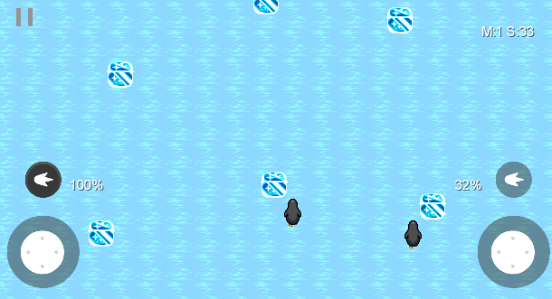

# Poi

## Relevant repository structure (core/src/com/poi/game) ##
   
    ├── controllers                                 # controller folder in MVC
    │   ├── BoostController.java
    │   ├── ChangeViewController.java
    │   ├── ColorController.java
    │   ├── ColorGameController.java
    │   ├── EndGameController.java
    │   ├── GameController.java
    │   ├── HelpController.java
    │   ├── HighscoreController.java
    │   ├── JoystickController.java
    │   ├── MenuController.java
    │   ├── PauseController.java
    │   ├── SettingsController.java
    │   └── Controller.java                          # template for controllers
    ├── models                                       # models folder in MVC  
    │   ├── buttons 
    │   │   ├── BoostComponent.java
    │   │   ├── ButtonComponent.java
    │   │   ├── JoystickComponent.java 
    │   │   └── PauseComponent.java                                               
    │   ├── clientServer 
    │   │   ├── CoreLeaderboard.java
    │   │   ├── Datahandler.java 
    │   │   └── Leaderboard.java 
    │   ├── entityComponents                         # entityComponents folder for ECS pattern
    │   │   ├── AnimationComponent.java
    │   │   ├── BodyComponent.java
    │   │   ├── ObstacleComponent.java
    │   │   ├── PauseComponent.java
    │   │   ├── PlayerComponent.java
    │   │   └── TextureComponent.java
    │   ├── entitySystems                           # entitySystems folder for ECS pattern
    │   │   ├── AnimationSystem.java
    │   │   ├── CameraBoundsCollisionSystem.java
    │   │   ├── CameraSystem.java
    │   │   ├── GoalSystem.java
    │   │   ├── MovementSystem.java
    │   │   └── TimerSystem.java
    │   └── ECSEngine.java                          # ECSEngine for ECS pattern
    ├── views                                       # views folder in MVC
    │   ├── ColorView.java
    │   ├── EndGameView.java
    │   ├── GameView.java
    │   ├── HelpView.java
    │   ├── HighscoreView.java
    │   ├── MenuView.java
    │   ├── SettingsView.java
    │   └── View.java                               # template for views
    ├── Factory.java
    ├── Poi.java
    ├── SoundManager.java
    └── WorldContactListener.java

Assets for the game are found at android/assets

## How to compile/run the project ##

### Equipment
<ul>
<li>Android Studio or other IDE for Android development</li>
<li>Emulator or Android device</li>
</ul>

### Installion
<ol>
<li>Clone the repository by running the following command in your terminal: </li>
    
    git clone https://gitlab.stud.idi.ntnu.no/proark/project.git
    
<li>Open the project folder in Android Studio</li>
<li>Run the android project on the emulator or on your Android device</li>
</ol>
